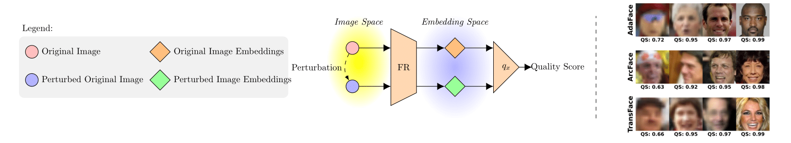
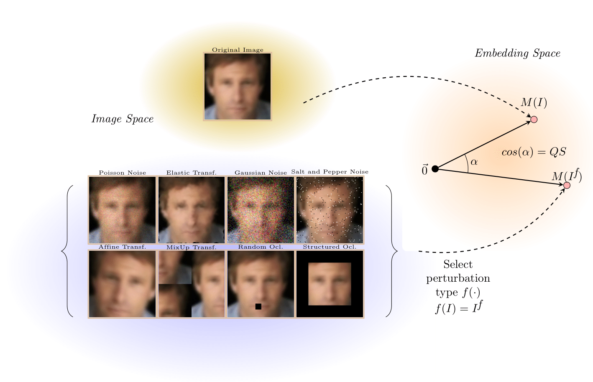

# FIQA Perturbations
We introduce a novel Face Image Quality Assessment (FIQA) methodology that focuses on the stability of face embeddings in the embedding space, evaluated through controlled perturbations. Our approach is predicated on the hypothesis that the quality of facial images is directly correlated with the stability of their embeddings; lower-quality images tend to exhibit greater variability upon perturbation. We have evaluated our model on three different FR models and three different datasets. We have also compared the results to state-of-the-art methods.

This schematic depicts the process of assessing image quality through a novel perturbation technique. Initially, the original image undergoes controlled perturbations to create a variant, symbolizing potential quality degradation. Both the original and perturbed images are then transformed into the embedding space using a Face Recognition (FR) model. In this space, we compute the cosine similarity between the embeddings of the original and perturbed images. The core hypothesis of our technique is that for lower-quality images, perturbations in the input space lead to more significant deviations in the embedding space, thereby resulting in a lower similarity score between the original and perturbed images. This stability of image embedding forms the backbone of our FIQA methodology. The quality scores displayed on the image are obtained using affine perturbation with the ArcFace FR model on the XQLFW database.

In our experimentation, we systematically explored a variety of perturbation techniques, including affine transformations, Poisson noise, Gaussian noise, and salt-and-pepper noise. Additionally, we investigated the effects of both random and structured occlusions, as well as elastic transformations and mixup transformations.

## Documentation

For detailed information, see our seminar paper: [seminar paper](docs/SBSSeminar.pdf).

## Model Weights

This project uses weights for the ArcFace, AdaFace, and TransFace models. The weights for these models must be downloaded and placed in their respective directories as described below:

- ArcFace weights: Place in `face_recognition/arcface`. Refer to the ArcFace paper for more details: [ArcFace: Additive Angular Margin Loss for Deep Face Recognition](https://arxiv.org/abs/1801.07698).
- AdaFace weights: Place in `face_recognition/adaface`. Refer to the AdaFace paper for more details: [AdaFace: Quality Adaptive Margin for Face Recognition](https://arxiv.org/abs/2204.00964).
- TransFace weights: Place in `face_recognition/transface`. Refer to the TransFace paper for more details: [TransFace: Translating a Face Embedding to a Recognizable Image](https://arxiv.org/abs/2308.10133).

### Important Note

After adding the weights, ensure that the paths to these weight files are correctly set in the `utils` and `main` files. This is crucial for the proper functioning of the face recognition models.

## Experimental Work

To run the experiments, navigate to the `/experimental_work` folder and execute the `main.py` script.
